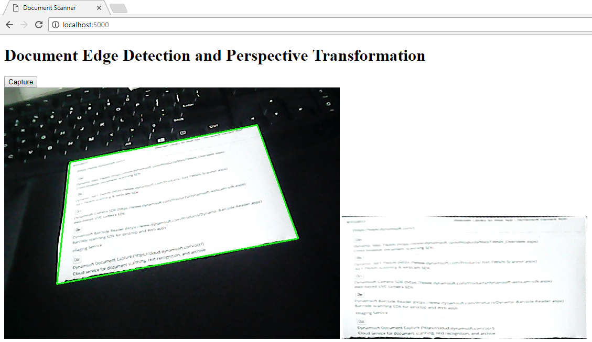

# Web Document Scanner
Use OpenCV-Python and Flask to create a web document scanner with a camera.

## Environment
* Python 3.5
* OpenCV 3.3.0

## How to Run 
1. Install **Flask**:

    ```
    pip install flask
    ```

2. Open **camera.py** and select a device:

    ```python
    self.cap = cv2.VideoCapture(2) # It should be 0 if you have only one device.
    ```

3. Run the app:

    ```
    python server.py
    ```
    

## 